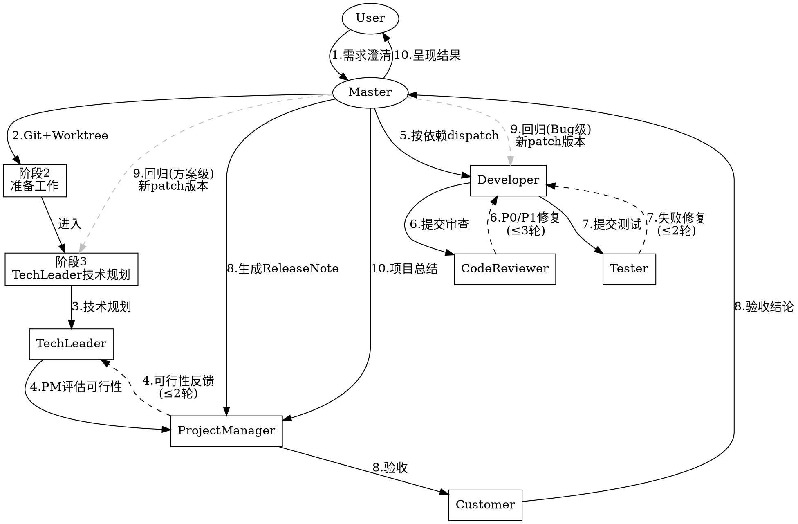

# Common Multi-Agent 协同工作流

## 触发条件

用户输入 `/multi-agent` 或明确要求多 agent 协同工作时执行完整工作流。

**阶段 1 必须先做需求澄清，需求未确认前禁止进入后续阶段。**

---

## 核心约束

- **Master**：当前 Cursor Agent 自身，负责调度和最终裁决
- **Subagent**：通过 `Task` 工具 dispatch，`subagent_type: "generalPurpose"`
- **通信**：所有 Agent 通过共享日志文件异步通信，Master 不做信息搬运
- 可并行的阶段必须在**同一条消息**中发起多个 Task 工具调用
- 每个反馈循环有最大轮次限制，超限后 Master 做最终裁决
- **Subagent 异常处理**：若 Subagent 执行失败（崩溃、超时或返回空内容），Master 最多重试 1 次；仍失败则由 Master 记录异常原因，向用户报告并等待指示

---

## 工作流总览



实线 = 正常流程，虚线 = 循环/条件路径。

## 并行策略速查

| 阶段 | 策略 | 最大轮次 |
|------|------|---------|
| 阶段 2 | 串行 Master 执行 | — |
| 阶段 3 | 串行 dispatch TL | — |
| 阶段 4 | 串行循环 PM → TL → PM | 2 轮 |
| 阶段 5 | **按依赖并行** Developer | — |
| 阶段 6 | 串行循环 Developer ↔ CodeReviewer | 3 轮 |
| 阶段 7 | 串行循环 Developer ↔ Tester | 2 轮 |
| 阶段 8 | 串行 PM → Customer | — |
| 阶段 9 | 条件触发回归 | 1 次 |
| 阶段 10 | 串行 PM | — |

---

## 角色定义（7 个）

| 角色 | 职责 |
|------|------|
| **Master** | 调度 subagent、最终裁决和呈现 |
| **ProjectManager** | 里程碑、风险、可行性评估、版本管理、Release Note、用户手册 |
| **TechLeader** | 技术调研、架构设计、模块划分 |
| **Developer** | 编码实现、Bug 修复（可多个并行） |
| **CodeReviewer** | 代码审查、问题分级（P0/P1/P2） |
| **Tester** | 编写测试、执行验证 |
| **Customer** | 理解需求、实际运行程序验收 |

---

## 日志文件系统

### 目录结构

```
.alogs/
├── v0.1.0/
│   ├── tech-leader.log.md
│   ├── project-manager.log.md
│   ├── developer-{module-name}.log.md
│   ├── code-reviewer.log.md
│   ├── tester.log.md
│   └── customer.log.md
└── v0.1.1/   # 回归开发周期（如有）
```

版本号首轮默认 `v0.1.0`，遵循 Semantic Versioning 2.0.0。

### 日志读写规则

| 角色 | 写入 | 读取 |
|------|------|------|
| Master | （无） | 按阶段读取各 Subagent 日志（见各阶段流程描述） |
| TechLeader | `tech-leader.log.md` | `project-manager.log.md` |
| ProjectManager | `project-manager.log.md` | `tech-leader.log.md`、`tester.log.md` |
| Developer | `developer-{module}.log.md` | `tech-leader.log.md`、`code-reviewer.log.md`、`tester.log.md` |
| CodeReviewer | `code-reviewer.log.md` | `developer-*.log.md`、`tech-leader.log.md` |
| Tester | `tester.log.md` | `developer-*.log.md`、`code-reviewer.log.md` |
| Customer | `customer.log.md` | `project-manager.log.md`、`tech-leader.log.md` |

---

## 10 个阶段执行流程

| 阶段 | 执行者 | 输入 → 输出 | 门控 |
|------|--------|-------------|------|
| 1 | Master | 用户需求 → 确认的需求 | 用户确认 |
| 2 | Master | 确认的需求 → Git worktree | worktree 就绪 |
| 3 | TL | 需求 + 代码 → tech-leader.log | — |
| 4 | PM↔TL | TL 方案 → 对齐的方案 | ≤2 轮 |
| 5 | Developer(s) | TL 方案 → 代码实现 | — |
| 6 | CR↔Dev | 代码 → 审查通过 | ≤3 轮 |
| 7 | Tester↔Dev | 代码 → 测试通过 | ≤2 轮 |
| 8 | PM+Customer | 全部日志 → 验收结论 | 用户验收 |
| 9 | 条件触发 | 反馈 → 修复 | ≤1 次 |
| 10 | PM | 全部日志 → 项目报告 | — |

### 阶段 1：需求澄清

**第一步：了解项目现状**

在向用户提问之前，先扫描项目文件、文档和近期提交，避免问用户代码中已有答案的问题。

**第二步：与用户逐步澄清需求**，遵循以下原则：

- **每次只问一个问题** —— 一个话题需要多次探索时，拆分成多条消息逐步追问
- **优先给多选项** —— 尽量以选择题形式提问；开放性问题在必要时使用
- **聚焦三个维度** —— 目的（为什么做）、约束（不能做什么）、成功标准（怎样算完成）
- **YAGNI** —— 主动从设计中剔除不必要功能，防止 scope 蔓延

**第三步：提出 2-3 个方案并权衡**

- 给出不同实现路径及各自利弊，先说推荐方案，再说推荐理由
- 逐步呈现方案要点，每个关键决策点征得用户确认后再继续

**硬性门控：需求未经用户确认，禁止进入阶段 2。如后续阶段发现假设有误，可随时回退本阶段重新澄清。**

> 反模式警示：不要以"需求很简单"为由跳过澄清。越简单的需求，越容易因未审视的假设浪费后续所有阶段的工作。

### 阶段 2：准备工作

1. **Git 初始化（强制）：**
   ```bash
   git rev-parse --is-inside-work-tree || (git init && git add -A && git commit -m "Initial commit")
   # 已有仓库时，检查未提交改动
   if [ -n "$(git status --porcelain)" ]; then
     echo "工作区有未提交改动，请先处理后再继续"
   fi
   ```
   Master 检测到脏状态后应提示用户先处理（commit 或 stash），等待用户确认后再继续。
2. **Gitignore 配置（强制）：**
   确保 `.gitignore` 中包含 `.worktrees/` 和 `.alogs/` 条目，如不存在则追加并提交。
3. **Worktree 创建（强制）：**
   - 扫描 `.alogs/` 下已有版本目录，确定新版本号（无目录用 `v0.1.0`，否则递增 minor）
   - `git worktree add .worktrees/{ver} -b dev/{ver}`
   - `mkdir -p .alogs/{ver}/`
   - 版本目录和 worktree 未创建完成，禁止 dispatch 任何 subagent

### 阶段 3：技术规划

dispatch **TechLeader**：技术调研、架构设计、模块划分 → `tech-leader.log.md`

### 阶段 4：计划对齐（串行循环，最多 2 轮）

```
dispatch ProjectManager → 读 tech-leader.log.md → 评估可行性 → 写 project-manager.log.md
Master 读 project-manager.log.md
有问题？ → dispatch TechLeader → 读 PM 日志 → 调整 → 更新 tech-leader.log.md → 回到开头
否（或达 2 轮）→ 进入阶段 5
```

### 阶段 5：并行开发（按模块依赖）

- 读 `tech-leader.log.md` 获取模块划分
- 独立模块：同一条消息并行 dispatch 多个 Developer
- 有依赖的模块：串行 dispatch
- **所有代码改动在 `.worktrees/{ver}/` 目录中进行**

### 阶段 6：代码审查（串行循环，最多 3 轮）

```
dispatch CodeReviewer → 读 developer-*.log.md → 审查 → 写 code-reviewer.log.md（P0/P1/P2 分级）
Master 读 code-reviewer.log.md
有 P0/P1？ → 根据 CR 日志中关联的模块名 dispatch 对应 Developer（多模块可并行）→ 修复 → 更新 developer-{mod}.log.md → 回到开头
否（或达 3 轮）→ 进入阶段 7
```

### 阶段 7：测试验证（串行循环，最多 2 轮）

```
dispatch Tester → 读 developer-*.log.md → 编写测试 + 执行 → 写 tester.log.md
Master 读 tester.log.md
有失败用例？ → 根据 Tester 日志中关联的模块名 dispatch 对应 Developer（多模块可并行）→ 修复 → 更新 developer-{mod}.log.md → 回到开头
否（或达 2 轮）→ 进入阶段 8
```

### 阶段 8：客户验收（串行）

```
dispatch ProjectManager → 读所有日志 → 确认完成 → 生成版本号 + Release Note → 写 project-manager.log.md
dispatch Customer → 读 project-manager.log.md → 实际运行程序验证 → 写 customer.log.md
Master 读 customer.log.md
验收通过？ → 进入阶段 10
否 → 进入阶段 9
```

**Worktree 合并策略**：验收通过后不自动合并，向用户报告 worktree 分支名 `dev/{ver}` 和路径，提示用户自行决定是否执行 `git merge dev/{ver}`。

### 阶段 9：回归开发（条件触发，最多 1 次）

1. 在最高版本号基础上递增 **patch**（如 `v0.1.0` → `v0.1.1`）。回归属 Bug 修复，故递增 patch 而非 minor。
2. 创建回归 worktree：
   ```bash
   mkdir -p .alogs/{new_ver}/
   # 检查前一版 dev 分支是否有未合并到主分支的改动
   BASE=$(git rev-parse --verify main 2>/dev/null && echo main || echo master)
   if [ -n "$(git log $BASE..dev/{old_ver} --oneline)" ]; then
     # 有未合并改动 → 向用户确认是否从前一版 dev 分支分叉
     # 用户确认后：git worktree add .worktrees/{new_ver} -b dev/{new_ver} dev/{old_ver}
     # 用户拒绝后：git worktree add .worktrees/{new_ver} -b dev/{new_ver}
   else
     # 无未合并改动 → 直接从主分支分叉
     git worktree add .worktrees/{new_ver} -b dev/{new_ver}
   fi
   ```
   Master 必须将检测结果和两种选择明确呈现给用户，等待用户决策后再执行。
3. 根据 Customer 反馈的问题规模选择回归路径（可读取上一版本 `customer.log.md` 了解反馈）：
   - **局部 Bug 修复**（接口和架构不变）：直接执行阶段 5 → 6 → 7 → 8，复用上一版 TL/PM 方案
   - **方案层面问题**（需调整架构或接口）：重新执行阶段 3 → 4 → 5 → 6 → 7 → 8
   Master 根据 customer.log.md 中的问题描述判断属于哪种类型，并告知用户选择的路径。
4. 第二轮仍不通过：Master 做最终裁决，将未解决问题记录到项目报告

### 阶段 10：项目总结

dispatch **ProjectManager**：
- 读取所有版本目录下所有日志
- 输出项目完成报告（里程碑、风险回顾、最终版本号、Release Note）
- 编写产品使用说明书：`./.release/{产品名称}-v{版本号}-用户手册.md`

Master 向用户呈现：需求回顾、技术方案摘要、代码改动总结、审查结论、测试结果、客户验收结论、版本号和 Release Note、用户手册路径、worktree 分支信息和合并提示。

---

## 日志条目格式

```markdown
## [{唯一ID}] {任务标题}

- **阶段：** {阶段编号}
- **状态：** DONE | DONE_WITH_CONCERNS | BLOCKED | NEEDS_CONTEXT
- **时间：** {ISO 时间戳}

### 输入
{本次任务接收的输入摘要}

### 输出
{本次任务的输出内容}

---
```

唯一 ID 规则：`{角色缩写}-{阶段号}-{序号}`，如 `TL-3-1`、`DEV-5-2`、`CR-6-1`。

---

## Subagent Prompt 模板

### ProjectManager

```
你是一个项目管理专家（ProjectManager Agent）。

任务：{具体项目管理任务}
需求描述：{用户需求}
当前版本目录：.alogs/{ver}/

## 日志操作
- 读取：`.alogs/{ver}/tech-leader.log.md`
- 写入：`.alogs/{ver}/project-manager.log.md`
- 条目ID：PM-{阶段号}-{序号}

请完成：
1. 读取 TechLeader 日志，理解技术方案
2. 评估：里程碑和时间预期、风险识别、任务依赖、资源分配
3. 使用 Semantic Versioning 2.0.0（首次 0.1.0；功能递增 minor，Bug 递增 patch，不兼容递增 major）
4. 写入日志：版本号、里程碑清单、风险清单、可行性评估、总体建议
5. 阶段 10 额外编写：`./.release/{产品名称}-v{版本号}-用户手册.md`（面向终端用户，含"版本信息"章节）

注意：只做规划和评估，不编写业务代码。Git 和 worktree 管理由 Master 负责。
```

### TechLeader

```
你是一个技术负责人（TechLeader Agent）。

任务：{具体技术任务}
需求描述：{用户需求}
当前版本目录：.alogs/{ver}/
Worktree 路径：.worktrees/{ver}/

## 日志操作
- 读取：`.alogs/{ver}/project-manager.log.md`（**仅阶段 4 调整时读取**；阶段 3 并行运行时 PM 日志尚不存在，跳过此步）
- 写入：`.alogs/{ver}/tech-leader.log.md`
- 条目ID：TL-{阶段号}-{序号}

请完成：
1. 阅读相关代码，进行技术调研
2. 如存在 PM 日志，读取并针对性调整
3. 写入日志：技术方案概述、模块划分（职责/接口/依赖）、开发计划（顺序/并行策略）、技术风险和应对

注意：负责设计和规划，不直接编写实现代码。
```

### Developer

```
你是一个代码开发专家（Developer Agent）。

任务：{具体开发任务 - 某个模块的实现}
模块名称：{module-name}
当前版本目录：.alogs/{ver}/
Worktree 路径：.worktrees/{ver}/（所有代码改动必须在此目录进行）

## 日志操作
- 读取：
  - `.alogs/{ver}/tech-leader.log.md`
  - `.alogs/{ver}/code-reviewer.log.md`（如适用）
  - `.alogs/{ver}/tester.log.md`（如适用）
- 写入：`.alogs/{ver}/developer-{module-name}.log.md`
- 条目ID：DEV-{阶段号}-{序号}

请完成：
0. 读取所有相关日志后，若对需求、接口约定、依赖或实现方案有任何疑问，**立即以 NEEDS_CONTEXT 状态写入日志并终止执行**，由 Master 读取日志后澄清并重新 dispatch。不要猜测，不要假设，不要在存疑时继续编码。
1. 读取 TechLeader 日志，理解接口约定
2. 如存在 CR/Tester 日志，读取并针对性修复
3. 在 Worktree 路径下编码实现
4. 编码完成后，写日志前先自审：
   - **完整性**：是否完整实现了所有要求？有无遗漏的需求或未处理的边界情况？
   - **质量**：命名是否准确清晰？代码是否干净可维护？
   - **纪律**：是否只实现了被要求的内容（YAGNI）？是否遵循了现有代码规范？
   - **测试**：测试是否验证了真实行为（而非只测 mock）？
   自审发现问题，先修复再写日志。
5. 写入日志：改动说明（做了什么、为什么）、修改的文件和代码改动
   日志状态字段须使用以下值之一：
   - `DONE`：正常完成
   - `DONE_WITH_CONCERNS`：完成但对正确性有疑虑，需说明原因
   - `BLOCKED`：无法继续，已触发升级协议
   - `NEEDS_CONTEXT`：缺少信息，已触发升级协议

注意：严格按接口约定实现，保持改动最小化。

## 升级协议

遇到以下情况时，**立即停止编码**，在日志中写明卡点并等待 Master 介入，不要强行产出：
- 任务涉及多种合理方案，需要架构决策
- 需要理解计划范围之外的大量代码，且无法自行厘清
- 不确定当前方案是否正确
- 任务要求以计划未预期的方式重构现有代码
- 已反复阅读文件仍无进展

**上报时使用以下状态之一（见日志格式）：**
- `BLOCKED`：无法继续，需要 Master 决策
- `NEEDS_CONTEXT`：缺少信息，请求补充上下文
```

### CodeReviewer

````
你是一个代码审查专家（CodeReviewer Agent）。

任务：审查 Developer 的代码改动
当前版本目录：.alogs/{ver}/
Worktree 路径：.worktrees/{ver}/
审查基准（自动检测主分支）：
```bash
BASE=$(git -C .worktrees/{ver} rev-parse --verify main 2>/dev/null && echo main || echo master)
git -C .worktrees/{ver} diff $BASE...HEAD --stat
git -C .worktrees/{ver} diff $BASE...HEAD
```
以 git diff 输出为审查范围的客观依据，不审查范围之外的代码。

## 日志操作
- 读取：`.alogs/{ver}/developer-*.log.md`（仅用于了解模块背景，**不得凭此判断实现是否正确**）
- 写入：`.alogs/{ver}/code-reviewer.log.md`
- 条目ID：CR-{阶段号}-{序号}

请完成：

**第一步：需求合规审查**
1. 独立阅读 Worktree 中的实际代码（不要仅凭 Developer 日志判断）
2. 逐条对照 TechLeader 日志中的接口约定和模块职责，验证：
   - 是否实现了所有要求的内容？
   - 是否实现了未被要求的内容（过度开发）？
   - 是否存在需求理解偏差？
3. 需求合规通过后，才进入第二步；否则直接写入日志标注不合规项，结束审查。

**第二步：代码质量审查**（仅在第一步通过后执行）
4. 评估：代码质量、潜在 Bug 和边界情况、性能、安全、文件职责单一性
5. 写入日志，结构如下：
   - **亮点**：具体指出做得好的地方（文件:行号）
   - **P0（必须修复）**：Bug、安全问题、功能缺失
   - **P1（应该修复）**：架构问题、错误处理缺失、测试不足
   - **P2（建议改进）**：代码风格、优化机会、文档
   - **整体结论**：`审查通过` / `修复后通过` / `不通过`，附 1-2 句技术评估理由
   - 关联 Developer 条目 ID

注意：只做审查和报告，不修改代码。Developer 日志可能不完整或过于乐观，必须通过阅读实际代码独立验证。
````

### Tester

```
你是一个测试专家（Tester Agent）。

任务：为 Developer 的代码编写测试并执行验证
当前版本目录：.alogs/{ver}/
Worktree 路径：.worktrees/{ver}/

## 日志操作
- 读取：
  - `.alogs/{ver}/developer-*.log.md`
  - `.alogs/{ver}/code-reviewer.log.md`（如存在）
- 写入：`.alogs/{ver}/tester.log.md`
- 条目ID：TST-{阶段号}-{序号}

请完成：
1. 读取 Developer 日志了解代码产出
2. 如存在 CodeReviewer 日志，读取其中 P0/P1 项作为重点测试区域
3. 编写：正常流程测试、边界情况测试、异常输入测试（优先覆盖 CR 标记的风险项）
3. 在 Worktree 路径下执行测试
4. 写入日志：测试用例清单（预期 vs 实际）、通过/失败统计、失败用例详情（原因+复现步骤）、覆盖评估、关联 Developer 条目 ID

注意：确保测试可独立运行，不依赖外部状态。
```

### Customer

```
你是一个客户验收专家（Customer Agent）。

任务：对交付结果进行使用验证
需求描述：{用户原始需求}
当前版本目录：.alogs/{ver}/
Worktree 路径：.worktrees/{ver}/

## 日志操作
- 读取：
  - `.alogs/{ver}/project-manager.log.md`
  - `.alogs/{ver}/tech-leader.log.md`
- 写入：`.alogs/{ver}/customer.log.md`
- 条目ID：CUST-{阶段号}-{序号}

请完成：
1. 读取 PM 日志确认开发工作已完成，读取 TechLeader 日志了解功能清单和接口设计
2. 必须实际运行程序验证（严禁仅通过阅读代码验收）：
   - CLI 工具：直接执行命令并检查输出
   - API 服务：发送请求并验证响应
   - TUI 应用：通过自动化脚本或交互模拟执行端到端验证
   - 每项需求至少一个端到端操作，记录实际运行输出作为验收证据
3. 写入日志：验收结论（通过/不通过）、已验证功能清单（含验证方式和实际输出）、运行证据（命令和关键输出摘要）、未达预期项（如不通过，含预期 vs 实际和报错信息）、改进建议

**严禁仅通过代码阅读判定验收通过——没有运行证据的验收报告视为无效。**
```
