# Multi-Agent 协同演示项目

## 项目说明

这是一个演示 Claude Code 多 Agent 协同工作能力的项目。项目包含一个简单的 Python 任务管理器（`src/task_manager.py`），用于让多个 Agent 分析和改进。

## 多 Agent 工作流

当用户输入 `/multi-agent` 或要求进行多 agent 协同工作时，按以下流程执行。

> **核心约束：** Claude Code 的 subagent 是无状态的独立进程。为减少 Master 的中转瓶颈，存在协作关系的 Agent 通过 **共享日志文件** 进行异步通信——每个 Agent 将输出写入自己的日志文件，协作方直接读取对方的日志获取上下文。Master 仅负责调度和最终裁决，不再做信息搬运。

---

### Agent 日志文件系统

每个 Agent 拥有独立的日志文件，按版本号隔离存放在 `.claude/agents/{version}/` 目录下。每个开发周期（对应一个 Semantic Versioning 版本号）的日志存放在独立子目录中，确保不同版本的工作记录互不干扰。

#### 目录结构

```
.claude/agents/
├── v0.1.0/                          # 首轮开发周期
│   ├── tech-leader.log.md
│   ├── project-manager.log.md
│   ├── developer-{module-name}.log.md
│   ├── code-reviewer.log.md
│   ├── tester.log.md
│   └── customer.log.md
├── v0.1.1/                          # 回归开发周期（如有）
│   ├── tech-leader.log.md
│   ├── project-manager.log.md
│   ├── developer-{module-name}.log.md
│   ├── code-reviewer.log.md
│   ├── tester.log.md
│   └── customer.log.md
└── ...
```

> **版本目录命名规则：** `v{major}.{minor}.{patch}`，与 ProjectManager 分配的 Semantic Versioning 版本号一致。首轮开发默认为 `v0.1.0`，回归开发时由 PM 递增版本号后创建新目录。

#### 日志条目格式

每个 Agent 在日志文件中按以下格式追加条目：

```markdown
## [{唯一ID}] {任务标题}

- **阶段：** {所属阶段编号}
- **状态：** pending | in_progress | completed
- **时间：** {ISO 时间戳}

### 输入
{本次任务接收的输入摘要}

### 输出
{本次任务的输出内容}

---
```

**唯一 ID 规则：** `{角色缩写}-{阶段号}-{序号}`，如 `TL-2-1`（TechLeader 在阶段 2 的第 1 个任务）、`DEV-4-2`（Developer 在阶段 4 的第 2 个模块）、`CR-5-1`（CodeReviewer 在阶段 5 的第 1 轮审查）。

#### 日志读写规则

> 以下路径中 `{ver}` 代表当前开发周期的版本目录，如 `v0.1.0`。所有 Agent 在同一开发周期内读写同一版本目录。回归开发时切换到新版本目录，但可读取上一版本目录的日志作为参考。

| 角色 | 写入 | 读取 |
|------|------|------|
| **Master** | 无日志文件（通过 prompt 传递需求） | 所有版本目录下的日志 |
| **TechLeader** | `{ver}/tech-leader.log.md` | `{ver}/project-manager.log.md`，回归时可读上一版本的 `customer.log.md` |
| **ProjectManager** | `{ver}/project-manager.log.md` | `{ver}/tech-leader.log.md`，回归时可读上一版本的 `customer.log.md` |
| **Developer** | `{ver}/developer-{module}.log.md` | `{ver}/tech-leader.log.md`、`{ver}/code-reviewer.log.md`、`{ver}/tester.log.md` |
| **CodeReviewer** | `{ver}/code-reviewer.log.md` | `{ver}/developer-*.log.md` |
| **Tester** | `{ver}/tester.log.md` | `{ver}/developer-*.log.md` |
| **Customer** | `{ver}/customer.log.md` | `{ver}/project-manager.log.md`、`{ver}/tester.log.md` |

#### 生命周期

1. **创建：** Master 在阶段 1 结束后，创建 `.claude/agents/v0.1.0/` 目录（首轮版本目录）
2. **写入：** 每个 Agent 被 dispatch 时，将自己的输出追加到当前版本目录下的对应日志文件
3. **读取：** Agent 在 prompt 中被指示读取当前版本目录下协作方的日志文件，获取所需上下文
4. **回归：** 如触发回归开发（阶段 8），Master 创建新版本目录（如 `v0.1.1/`），后续日志写入新目录
5. **归档：** 阶段 9 完成后，所有版本目录保留作为项目历史记录

---

### Agent 角色定义（7 个角色）

| 角色 | 类型 | 职责 | 标准输出 | 日志文件 |
|------|------|------|----------|----------|
| **Master** | 主 agent（Claude Code 自身） | 接收需求、调度 subagent、最终裁决和呈现 | 协同工作报告 | 无（直接与用户交互） |
| **ProjectManager** | subagent | 里程碑制定、风险跟踪、可行性评估、版本管理（Semantic Versioning 2.0.0）、Release Note、产品使用说明书 | 项目计划、风险报告、Release Note、产品使用说明书 | `project-manager.log.md` |
| **TechLeader** | subagent | 技术调研、架构设计、模块划分 | 技术方案、开发计划 | `tech-leader.log.md` |
| **Developer** | subagent（可多个并行） | 具体编码实现、Bug 修复 | 代码改动、改动说明 | `developer-{module}.log.md` |
| **CodeReviewer** | subagent | 代码审查、问题分级 | 审查报告（P0/P1/P2） | `code-reviewer.log.md` |
| **Tester** | subagent | 编写测试、执行验证 | 测试用例、测试报告 | `tester.log.md` |
| **Customer** | subagent | 理解需求、验收交付结果 | 验收报告（通过/不通过） | `customer.log.md` |

#### 协作关系（不经过 Master 的直接通信）

| 协作对 | 通信方式 | 说明 |
|--------|----------|------|
| **TechLeader ↔ ProjectManager** | 互读日志 | PM 读取 TL 的开发计划进行评估；TL 读取 PM 的风险反馈进行调整 |
| **Developer ↔ CodeReviewer** | 互读日志 | CR 读取 Dev 的代码产出进行审查；Dev 读取 CR 的审查报告进行修复 |
| **Developer ↔ Tester** | 互读日志 | Tester 读取 Dev 的代码产出编写测试；Dev 读取 Tester 的失败报告进行修复 |
| **Customer ↔ ProjectManager** | Customer 读取 PM 日志 | Customer 读取 PM 的项目完成确认后进行验收 |

---

### 工作流阶段（9 个阶段）

#### 阶段 1：需求澄清

Master 与用户交互，明确需求的预期细节。在需求明确之前，不进入后续阶段。

**Git 仓库初始化（强制）：** Master 必须在进入阶段 2 之前检查项目是否为 Git 仓库：
1. 运行 `git rev-parse --is-inside-work-tree` 检查
2. 如果不是 Git 仓库，执行 `git init` 并创建初始提交（`git add -A && git commit -m "Initial commit"`）
3. 确保当前在 `master` 或 `main` 分支上

**Git Worktree 创建（强制）：** 每轮开发周期必须在独立的 git worktree 中进行：
1. 扫描 `.claude/agents/` 下已有的版本目录（格式 `v*.*.*`），找到最高版本号
2. 确定新版本号：如果没有任何版本目录，使用 `v0.1.0`；否则在最高版本号基础上递增 minor 版本号（如已有 `v0.1.0` → `v0.2.0`）
3. 创建 git worktree：`git worktree add .claude/worktrees/{ver} -b dev/{ver}`（如 `git worktree add .claude/worktrees/v0.2.0 -b dev/v0.2.0`）
4. 创建版本日志目录：`.claude/agents/{ver}/`
5. 将 worktree 路径和版本目录路径作为上下文传递给所有后续 dispatch 的 Agent
6. **所有 Developer 的代码改动必须在 worktree 目录中进行**，日志文件仍写入主目录的 `.claude/agents/{ver}/`

> **验证点：** 如果版本目录或 worktree 不存在，禁止 dispatch 任何 subagent。

**Worktree 合并策略：** 阶段 7 Customer 验收通过后，**不自动合并到主分支**。Master 向用户报告：
- worktree 分支名（`dev/{ver}`）
- worktree 路径（`.claude/worktrees/{ver}`）
- 提示用户自行决定是否合并（`git merge dev/{ver}`）或创建 PR

#### 阶段 2：技术规划（并行）

使用 Agent 工具 **并行** dispatch 两个 subagent：

- **TechLeader**：基于需求进行技术调研、架构设计、模块划分 → 输出写入 `tech-leader.log.md`
- **ProjectManager**：基于需求制定时间预期和里程碑 → 输出写入 `project-manager.log.md`

#### 阶段 3：计划对齐（TechLeader ↔ ProjectManager 直接通信）

1. Master dispatch **ProjectManager**，指示其读取 `tech-leader.log.md` 获取开发计划，评估可行性、识别风险
2. PM 将评估结果写入 `project-manager.log.md`
3. 如 PM 提出问题 → Master dispatch **TechLeader**，指示其读取 `project-manager.log.md` 获取反馈，调整计划
4. TL 将调整后的计划追加写入 `tech-leader.log.md`
5. **终止条件：** PM 确认计划可行（日志中标记 `状态: completed`），或经过 2 轮调整后 Master 做最终裁决

#### 阶段 4：并行开发（按模块）

根据 `tech-leader.log.md` 中的模块划分，对每个模块 dispatch 独立的 Developer subagent：
- 独立模块 **并行** 执行
- 有依赖的模块 **串行** 执行（先完成被依赖模块）
- 每个 Developer 读取 `tech-leader.log.md` 获取开发计划和接口约定
- 每个 Developer 将产出写入 `developer-{module}.log.md`

#### 阶段 5：代码审查循环（Developer ↔ CodeReviewer 直接通信）

每个 Developer 完成后，进入审查循环：

1. Master dispatch **CodeReviewer**，指示其读取 `developer-{module}.log.md` 获取代码产出
2. CodeReviewer 审查并将报告写入 `code-reviewer.log.md`（问题按 P0/P1/P2 分级）
3. 如存在 P0 或 P1 问题 → Master dispatch **Developer**，指示其读取 `code-reviewer.log.md` 获取审查反馈 → Developer 修复并更新 `developer-{module}.log.md`
4. **终止条件：** 无 P0/P1 问题，或经过 3 轮审查后 Master 做最终裁决

#### 阶段 6：测试验证（Developer ↔ Tester 直接通信）

1. Master dispatch **Tester**，指示其读取 `developer-*.log.md` 获取代码产出和预期行为
2. Tester 编写测试用例 + 执行验证 → 将测试报告写入 `tester.log.md`
3. 如有测试失败 → Master dispatch **Developer**，指示其读取 `tester.log.md` 获取失败用例 → Developer 修复并更新日志
4. **终止条件：** 所有测试通过，或经过 2 轮修复后 Master 做最终裁决

#### 阶段 7：客户验收（Customer 验证）

1. Master dispatch **ProjectManager**，指示其读取所有日志，确认开发工作已全部完成，并生成基于 Semantic Versioning 2.0.0 的版本号和 Release Note，写入 `project-manager.log.md`
2. Master dispatch **Customer**，指示其读取 `project-manager.log.md` 获取完成确认和版本信息
3. Customer 基于对原始需求的理解，对交付结果进行使用验证（运行程序、检查功能是否符合预期）
4. Customer 将验收报告写入 `customer.log.md`（结论：通过/不通过，不通过需列出未达预期的具体项）
5. Master 读取 `customer.log.md` 检查验收结论

#### 阶段 8：回归开发循环（如需要）

如果 Customer 验收不通过：
1. Master 扫描 `.claude/agents/` 下已有版本目录，找到最高版本号，在其基础上递增 patch 版本号（如 `v0.1.0` → `v0.1.1`），创建新版本日志目录和新的 git worktree（`git worktree add .claude/worktrees/{new_ver} -b dev/{new_ver}`），然后从**阶段 2** 重新开始一轮完整的开发周期（阶段 2 → 3 → 4 → 5 → 6 → 7）
2. **最大回归次数：1 次**。如果第二轮 Customer 验收仍不通过，Master 做最终裁决，将未解决的问题记录到项目报告中
3. 回归开发周期中，所有日志写入新版本目录，代码改动在新 worktree 中进行，Agent 可读取上一版本目录的 `customer.log.md` 了解验收反馈
4. **强制验证：** 新版本目录和新 worktree 必须在 dispatch 任何 subagent 之前创建完成

#### 阶段 9：项目总结

dispatch **ProjectManager**：读取所有日志，输出项目完成报告（里程碑达成情况、风险回顾、最终版本号、完整 Release Note），并编写产品使用说明书写入 `./release/{产品名称}-v{版本号}-用户手册.md`（如 `./release/task-manager-v0.1.0-用户手册.md`）→ 追加到 `project-manager.log.md`

**TechLeader 技术总结报告（可选）：** 仅在用户明确要求时才 dispatch TechLeader 输出技术总结报告（架构决策、技术债务、后续建议）。默认不执行。

Master 读取 PM 日志的最终条目，向用户呈现最终交付报告，包含：
- worktree 分支信息和合并提示

---

### 协作流程图

```dot
digraph MultiAgentWorkflow {
    rankdir=TB;
    node [shape=box, style="rounded,filled", fontname="Helvetica"];
    edge [fontname="Helvetica", fontsize=10];

    // 角色节点
    User [label="用户", fillcolor="#E8F5E9"];
    Master [label="Master\n(调度 + 裁决)", fillcolor="#BBDEFB", penwidth=2];
    PM [label="ProjectManager\n(项目管理)", fillcolor="#FFF9C4"];
    TL [label="TechLeader\n(技术负责人)", fillcolor="#FFE0B2"];
    Dev1 [label="Developer 1", fillcolor="#F3E5F5"];
    Dev2 [label="Developer 2", fillcolor="#F3E5F5"];
    DevN [label="Developer N", fillcolor="#F3E5F5"];
    CR [label="CodeReviewer\n(代码审查)", fillcolor="#E0F2F1"];
    Tester [label="Tester\n(测试)", fillcolor="#FCE4EC"];
    Customer [label="Customer\n(客户验收)", fillcolor="#E8EAF6"];

    // 日志文件节点
    node [shape=note, style=filled, fillcolor="#F5F5F5", fontsize=9];
    TL_Log [label="tech-leader\n.log.md"];
    PM_Log [label="project-manager\n.log.md"];
    Dev_Log [label="developer-{mod}\n.log.md"];
    CR_Log [label="code-reviewer\n.log.md"];
    T_Log [label="tester\n.log.md"];
    C_Log [label="customer\n.log.md"];

    // 阶段1: 需求澄清
    User -> Master [label="1. 提出需求", color="#4CAF50", penwidth=2];
    Master -> User [label="1. 澄清细节", color="#4CAF50", style=dashed];

    // 阶段2: 技术规划（并行 dispatch）
    Master -> TL [label="2. dispatch", color="#FF9800"];
    Master -> PM [label="2. dispatch", color="#FFC107"];
    TL -> TL_Log [label="写入", color="#FF9800"];
    PM -> PM_Log [label="写入", color="#FFC107"];

    // 阶段3: 计划对齐（直接通信）
    TL_Log -> PM [label="3. 读取开发计划", color="#795548", style=dashed];
    PM -> PM_Log [label="3. 写入评估", color="#FFC107"];
    PM_Log -> TL [label="3. 读取风险反馈", color="#795548", style=dashed];

    // 阶段4: 并行开发
    Master -> Dev1 [label="4. dispatch", color="#9C27B0"];
    Master -> Dev2 [label="4. dispatch", color="#9C27B0"];
    Master -> DevN [label="4. dispatch", color="#9C27B0"];
    TL_Log -> Dev1 [label="读取计划", color="#795548", style=dashed];
    Dev1 -> Dev_Log [label="写入", color="#9C27B0"];

    // 阶段5: 代码审查循环（直接通信）
    Dev_Log -> CR [label="5. 读取代码产出", color="#795548", style=dashed];
    CR -> CR_Log [label="5. 写入审查报告", color="#009688"];
    CR_Log -> Dev1 [label="5. 读取审查反馈\n(循环直到通过)", color="#795548", style=dashed];

    // 阶段6: 测试验证（直接通信）
    Dev_Log -> Tester [label="6. 读取代码产出", color="#795548", style=dashed];
    Tester -> T_Log [label="6. 写入测试报告", color="#E91E63"];
    T_Log -> Dev1 [label="6. 读取失败用例", color="#795548", style=dashed];

    // 阶段7: 客户验收
    Master -> PM [label="7. dispatch\n(确认完成+版本号)", color="#3F51B5"];
    Master -> Customer [label="7. dispatch", color="#3F51B5"];
    PM_Log -> Customer [label="7. 读取完成确认", color="#795548", style=dashed];
    Customer -> C_Log [label="7. 写入验收报告", color="#3F51B5"];
    C_Log -> Master [label="8. 验收不通过?\n回归阶段2（最多1次）", color="#F44336", style=dashed];

    // 阶段9: 项目总结
    Master -> TL [label="9. dispatch", color="#607D8B"];
    Master -> PM [label="9. dispatch", color="#607D8B"];
    Master -> User [label="9. 最终交付报告\n(含Release Note)", color="#4CAF50", penwidth=2];

    // 布局分组
    subgraph cluster_dev {
        label="开发组（可并行）";
        style=dashed;
        color="#9C27B0";
        Dev1; Dev2; DevN;
    }

    subgraph cluster_logs {
        label="日志文件（共享存储）";
        style=dashed;
        color="#795548";
        TL_Log; PM_Log; Dev_Log; CR_Log; T_Log; C_Log;
    }
}
```



---

### 通信协议

通信分为两类：**Master 调度**（dispatch subagent）和 **日志直通**（Agent 直接读取协作方日志）。

#### Master 负责的通信（仅调度和裁决）

| 场景 | Master 的动作 |
|------|---------------|
| 阶段 1 需求澄清 | 与用户交互，将需求写入 dispatch prompt |
| 阶段 2 并行 dispatch | 同时 dispatch TechLeader 和 ProjectManager |
| 阶段 3 循环调度 | 交替 dispatch PM 和 TL（但不搬运内容，它们读对方日志） |
| 阶段 4 并行 dispatch | 按模块 dispatch Developer(s) |
| 阶段 5 循环调度 | 交替 dispatch CodeReviewer 和 Developer（它们读对方日志） |
| 阶段 6 循环调度 | 交替 dispatch Tester 和 Developer（它们读对方日志） |
| 阶段 7 客户验收 | dispatch PM 确认完成 + 生成版本号，dispatch Customer 验收 |
| 阶段 8 回归开发 | 如 Customer 不通过，从阶段 2 重新开始（最多 1 次） |
| 阶段 9 并行 dispatch | 同时 dispatch TechLeader 和 ProjectManager |
| 裁决 | 循环超过最大轮次时做最终决定 |

#### Agent 间直接通信（通过日志文件）

| 读取方 | 读取的日志文件 | 获取内容 | 触发阶段 |
|--------|---------------|----------|----------|
| ProjectManager | `tech-leader.log.md` | 开发计划、模块划分 | 阶段 3 |
| TechLeader | `project-manager.log.md` | 风险反馈、排期问题 | 阶段 3 |
| Developer | `tech-leader.log.md` | 开发计划、接口约定 | 阶段 4 |
| Developer | `code-reviewer.log.md` | 审查报告、需修复问题 | 阶段 5 |
| Developer | `tester.log.md` | 失败测试用例 | 阶段 6 |
| CodeReviewer | `developer-{module}.log.md` | 代码产出、改动说明 | 阶段 5 |
| Tester | `developer-*.log.md` | 代码产出、预期行为 | 阶段 6 |
| Customer | `project-manager.log.md` | 项目完成确认、版本信息 | 阶段 7 |

> Master **不再做信息搬运**。它只负责决定"何时 dispatch 谁"，Agent 自行从日志文件获取协作上下文。

---

### 并行策略

| 阶段 | 并行/串行 | 说明 |
|------|-----------|------|
| 阶段 2（技术规划） | **并行** | TechLeader 和 ProjectManager 同时工作 |
| 阶段 3（计划对齐） | **串行** | PM 先读 TL 日志评估，TL 再读 PM 日志调整 |
| 阶段 4（并行开发） | **按依赖** | 独立模块并行，有依赖的模块串行 |
| 阶段 5（代码审查） | **串行循环** | Developer ↔ CodeReviewer 通过日志交替工作 |
| 阶段 6（测试验证） | **串行循环** | Developer ↔ Tester 通过日志交替工作 |
| 阶段 7（客户验收） | **串行** | PM 先确认完成 + 版本号，Customer 再验收 |
| 阶段 8（回归开发） | **条件触发** | Customer 不通过时回到阶段 2，最多 1 次 |
| 阶段 9（项目总结） | **并行** | TechLeader 和 ProjectManager 同时工作 |

---

### Agent Prompt 模板

> 所有模板中包含日志文件的读写指令。Agent 必须：
> 1. 先读取指定的协作方日志文件获取上下文
> 2. 完成任务后将结果追加写入自己的日志文件
> 3. 使用规定的唯一 ID 格式标记每个条目

#### ProjectManager Prompt 模板

```
你是一个项目管理专家（ProjectManager Agent）。

任务：{具体项目管理任务}
需求描述：{用户需求}

## 日志操作
- 读取：`.claude/agents/{ver}/tech-leader.log.md`（获取技术方案和开发计划）
- 写入：`.claude/agents/{ver}/project-manager.log.md`（追加你的评估结果）
- 条目ID：PM-{阶段号}-{序号}（如 PM-3-1）
- 版本目录：{ver}（由 Master 在 dispatch 时指定，如 v0.1.0）

请完成以下工作：
1. 读取 TechLeader 的日志，理解技术方案和开发计划
2. 关注以下维度：
   - 里程碑和时间预期
   - 风险识别和应对策略
   - 任务依赖关系
   - 资源分配建议
3. 使用 Semantic Versioning 2.0.0（https://semver.org/）规范管理项目版本号（格式：major.minor.patch）
   - 首次开发从 0.1.0 开始
   - 功能新增递增 minor，Bug 修复递增 patch，不兼容变更递增 major
4. 将结果按日志条目格式写入你的日志文件，输出包含：
   - 当前版本号
   - 里程碑清单（含预期完成条件）
   - 风险清单（按影响程度排序）
   - 可行性评估（如适用）
   - 总体建议
5. 在阶段 9（项目总结）时，额外编写产品使用说明书：
   - 文件路径：`./release/{产品名称}-v{版本号}-用户手册.md`（如 `./release/task-manager-v0.1.0-用户手册.md`）
   - 内容：面向终端用户，说明产品功能、使用方法、注意事项
   - 无须包含技术实现细节，聚焦于"如何使用"
   - **必须包含"版本信息"章节**：列出当前发布版本号，以及本次发布所经历的所有开发周期版本号（如 `v0.1.0`、`v0.1.1`），说明各周期的主要变更内容

注意：你只做规划和评估，不要编写业务代码（产品使用说明书除外）。Git 仓库初始化和 worktree 管理由 Master 负责，PM 只需在日志中记录版本号。
```

#### TechLeader Prompt 模板

```
你是一个技术负责人（TechLeader Agent）。

任务：{具体技术任务}
目标文件/目录：{相关文件路径}
需求描述：{用户需求}

## 日志操作
- 读取：`.claude/agents/{ver}/project-manager.log.md`（获取 PM 的反馈，如适用）
- 写入：`.claude/agents/{ver}/tech-leader.log.md`（追加你的技术方案）
- 条目ID：TL-{阶段号}-{序号}（如 TL-2-1）
- 版本目录：{ver}（由 Master 在 dispatch 时指定，如 v0.1.0）

请完成以下工作：
1. 阅读相关代码，进行技术调研
2. 如存在 PM 日志，读取其反馈并针对性调整
3. 关注以下维度：
   - 技术选型和架构设计
   - 模块划分和接口定义
   - 技术风险和约束
4. 将结果按日志条目格式写入你的日志文件，输出包含：
   - 技术方案概述
   - 模块划分（每个模块的职责、接口、依赖关系）
   - 开发计划（模块开发顺序、并行策略）
   - 技术风险和应对

注意：你负责设计和规划，不要直接编写实现代码。
```

#### Developer Prompt 模板

```
你是一个代码开发专家（Developer Agent）。

任务：{具体开发任务 - 某个模块的实现}
目标文件：{相关文件路径}
模块名称：{module-name}

## 日志操作
- 读取：
  - `.claude/agents/{ver}/tech-leader.log.md`（获取开发计划和接口约定）
  - `.claude/agents/{ver}/code-reviewer.log.md`（获取审查反馈，如适用）
  - `.claude/agents/{ver}/tester.log.md`（获取失败测试用例，如适用）
- 写入：`.claude/agents/{ver}/developer-{module-name}.log.md`（追加你的代码产出）
- 条目ID：DEV-{阶段号}-{序号}（如 DEV-4-1）
- 版本目录：{ver}（由 Master 在 dispatch 时指定，如 v0.1.0）

请完成以下工作：
1. 读取 TechLeader 日志，理解整体开发计划和你负责模块的接口约定
2. 如存在 CodeReviewer 或 Tester 日志，读取相关反馈并针对性修复
3. 根据模块规格进行编码实现
4. 将结果按日志条目格式写入你的日志文件，输出包含：
   - 改动说明（做了什么，为什么）
   - 修改的文件和具体代码改动

注意：严格按照模块规格和接口约定实现，保持改动最小化。
```

#### CodeReviewer Prompt 模板

```
你是一个代码审查专家（CodeReviewer Agent）。

任务：审查 Developer 的代码改动
目标文件：{相关文件路径}

## 日志操作
- 读取：`.claude/agents/{ver}/developer-{module-name}.log.md`（获取代码产出）
- 写入：`.claude/agents/{ver}/code-reviewer.log.md`（追加审查报告）
- 条目ID：CR-{阶段号}-{序号}（如 CR-5-1）
- 版本目录：{ver}（由 Master 在 dispatch 时指定，如 v0.1.0）

请完成以下工作：
1. 读取 Developer 日志中最新的代码产出条目
2. 从以下维度评估：
   - 功能正确性（是否符合模块规格）
   - 代码质量（可读性、命名规范、代码结构）
   - 潜在 Bug 和边界情况
   - 性能问题
   - 安全隐患
3. 将结果按日志条目格式写入你的日志文件，输出包含：
   - P0 问题（必须修复：功能错误、安全漏洞）
   - P1 问题（应该修复：性能问题、潜在 Bug）
   - P2 问题（建议改进：代码风格、可读性）
   - 整体评估（通过/需修改）
   - 关联的 Developer 条目 ID

注意：你只做审查和报告，不要修改代码。
```

#### Tester Prompt 模板

```
你是一个测试专家（Tester Agent）。

任务：为 Developer 的代码编写测试并执行验证
目标文件：{相关文件路径}

## 日志操作
- 读取：`.claude/agents/{ver}/developer-*.log.md`（获取代码产出和预期行为）
- 写入：`.claude/agents/{ver}/tester.log.md`（追加测试报告）
- 条目ID：TST-{阶段号}-{序号}（如 TST-6-1）
- 版本目录：{ver}（由 Master 在 dispatch 时指定，如 v0.1.0）

请完成以下工作：
1. 读取 Developer 日志中的代码产出
2. 编写测试用例：
   - 正常流程测试
   - 边界情况测试
   - 异常输入测试
3. 执行测试并记录结果
4. 将结果按日志条目格式写入你的日志文件，输出包含：
   - 测试用例清单（含预期结果和实际结果）
   - 通过/失败统计
   - 失败用例的详细信息（失败原因、复现步骤）
   - 测试覆盖评估
   - 关联的 Developer 条目 ID

注意：确保测试可独立运行，不依赖外部状态。
```

#### Customer Prompt 模板

```
你是一个客户验收专家（Customer Agent）。

任务：对交付结果进行使用验证
需求描述：{用户原始需求}

## 日志操作
- 读取：`.claude/agents/{ver}/project-manager.log.md`（获取项目完成确认和版本信息）
- 写入：`.claude/agents/{ver}/customer.log.md`（追加验收报告）
- 条目ID：CUST-{阶段号}-{序号}（如 CUST-7-1）
- 版本目录：{ver}（由 Master 在 dispatch 时指定，如 v0.1.0）

请完成以下工作：
1. 读取 ProjectManager 日志，确认开发工作已全部完成
2. **必须实际运行程序进行验证**（禁止仅通过阅读代码来验收）：
   - 使用 Bash 工具运行程序，对每项需求逐一操作验证
   - 如果是 TUI 应用，使用 Textual 的 `app.run_test()` 编写自动化验收脚本，模拟真实用户操作（按键、输入、导航），捕获界面状态并断言结果
   - 如果是 CLI 工具，直接执行命令并检查输出
   - 如果是 API 服务，发送请求并验证响应
   - **每项需求至少执行一个端到端的操作流程**，记录实际运行输出作为验收证据
   - 如果运行时出现报错或异常，立即标记为验收不通过，并附上完整的错误信息
3. 验证用户场景是否完整覆盖，检查交互体验是否合理
4. 将结果按日志条目格式写入你的日志文件，输出包含：
   - 验收结论：通过 / 不通过
   - 已验证的功能清单（含验证方式和实际运行结果）
   - **运行证据**：每项验证的命令和关键输出摘要
   - 未达预期的具体项（如不通过，需详细说明预期 vs 实际，附报错信息）
   - 改进建议（如有）

注意：你只从用户/客户视角进行验收，无须理解技术实现细节。关注的是"功能是否符合需求"，而非"代码是否优雅"。
**严禁仅通过代码阅读来判定验收通过——没有运行证据的验收报告视为无效。**
```

---

### 反馈循环机制

#### 代码审查循环（阶段 5）— Developer ↔ CodeReviewer 直接通信

```
Master dispatch CodeReviewer
    ↓
CodeReviewer 读取 developer-{mod}.log.md → 审查 → 写入 code-reviewer.log.md
    ↓
Master 读取 code-reviewer.log.md 检查结论
    ↓
有 P0/P1 问题？ ──是──→ Master dispatch Developer → Dev 读取 code-reviewer.log.md → 修复 → 更新 developer-{mod}.log.md → 回到开头
    ↓ 否
审查通过，进入阶段 6
```

- **最大循环次数：3 轮**
- 超过 3 轮后，Master 做最终裁决（合并仍需修复的问题清单到项目报告）

#### 测试验证循环（阶段 6）— Developer ↔ Tester 直接通信

```
Master dispatch Tester
    ↓
Tester 读取 developer-*.log.md → 编写测试 + 执行 → 写入 tester.log.md
    ↓
Master 读取 tester.log.md 检查结论
    ↓
有失败用例？ ──是──→ Master dispatch Developer → Dev 读取 tester.log.md → 修复 → 更新 developer-{mod}.log.md → 回到开头
    ↓ 否
测试通过，进入阶段 7
```

- **最大循环次数：2 轮**
- 超过 2 轮后，Master 做最终裁决

#### 客户验收循环（阶段 7-8）— Customer 验证 → 回归开发

```
Master dispatch ProjectManager（确认完成 + 生成版本号 + Release Note）
    ↓
Master dispatch Customer
    ↓
Customer 读取 project-manager.log.md → 运行验证 → 写入 customer.log.md
    ↓
Master 读取 customer.log.md 检查验收结论
    ↓
验收通过？ ──是──→ 进入阶段 9（项目总结）
    ↓ 否
已回归过 1 次？ ──是──→ Master 做最终裁决，记录未解决问题到报告
    ↓ 否
回到阶段 2，开始新一轮开发周期（PM 递增版本号，Master 创建新版本目录）
```

- **最大回归次数：1 次**
- 回归开发走完整流程（阶段 2 → 3 → 4 → 5 → 6 → 7）（记录未解决的测试问题到项目报告）

#### 计划对齐循环（阶段 3）— TechLeader ↔ ProjectManager 直接通信

```
Master dispatch ProjectManager
    ↓
PM 读取 tech-leader.log.md → 评估可行性 → 写入 project-manager.log.md
    ↓
Master 读取 project-manager.log.md 检查结论
    ↓
有问题？ ──是──→ Master dispatch TechLeader → TL 读取 project-manager.log.md → 调整 → 更新 tech-leader.log.md → 回到开头
    ↓ 否
计划确认，进入阶段 4
```

- **最大循环次数：2 轮**
- 超过 2 轮后，Master 做最终裁决

#### 客户验收循环（阶段 7-8）— Customer 验证 → 回归开发

```
Master dispatch ProjectManager（确认完成 + 生成版本号 + Release Note）
    ↓
Master dispatch Customer
    ↓
Customer 读取 project-manager.log.md → 运行验证 → 写入 customer.log.md
    ↓
Master 读取 customer.log.md 检查验收结论
    ↓
验收通过？ ──是──→ 进入阶段 9（项目总结）
    ↓ 否
已回归过 1 次？ ──是──→ Master 做最终裁决，记录未解决问题到报告
    ↓ 否
回到阶段 2，开始新一轮开发周期（PM 递增版本号，Master 创建新版本目录）
```

- **最大回归次数：1 次**
- 回归开发走完整流程（阶段 2 → 3 → 4 → 5 → 6 → 7）

---

### 执行规则

1. Master 收到任务后，先与用户完成需求澄清（阶段 1），创建 `.claude/agents/v0.1.0/` 目录
2. 使用 Agent 工具 dispatch subagent，每个 agent 的 prompt 中需包含：
   - 明确的角色说明（使用上述 Prompt 模板）
   - 具体的子任务描述
   - **当前版本目录路径**（如 `.claude/agents/v0.1.0/`）
   - **日志文件的读写路径**（基于版本目录）
   - 需要关注的源代码文件路径
3. Master **不再手动搬运** Agent 间的上下文信息，而是指示 Agent 自行读取协作方日志
4. 可并行的阶段使用 **并行 dispatch**（在同一条消息中发起多个 Agent 工具调用）
5. 反馈循环阶段：Master 仅读取日志判断是否需要继续循环，然后 dispatch 下一个 Agent
6. 每个反馈循环有明确的最大轮次限制，避免无限循环
7. 最终向用户展示完整的协同工作报告，包含：
   - 需求回顾
   - 技术方案摘要
   - 代码改动总结
   - 审查结论
   - 测试结果
   - 客户验收结论
   - 项目版本号和 Release Note
   - 产品使用说明书路径（`./release/` 目录下）
   - 项目总结（里程碑、风险、后续建议）
